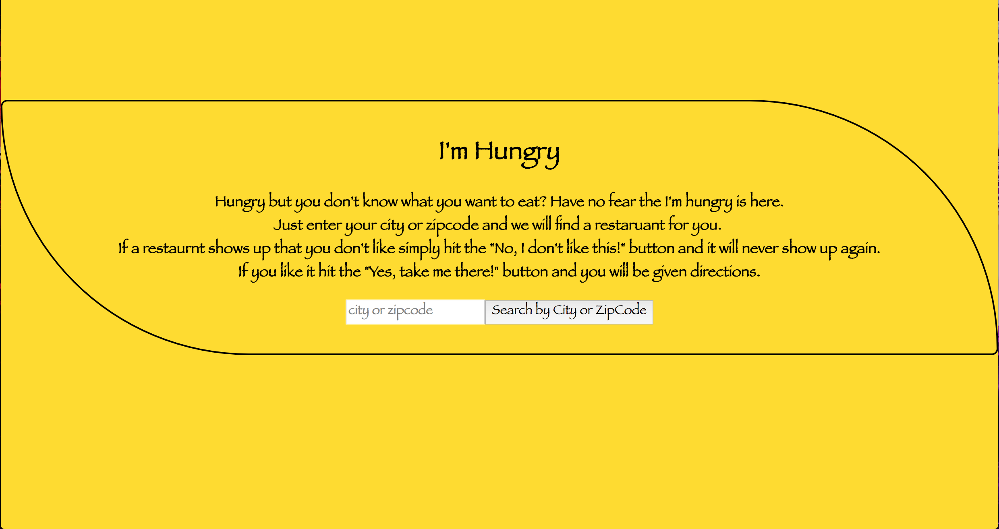
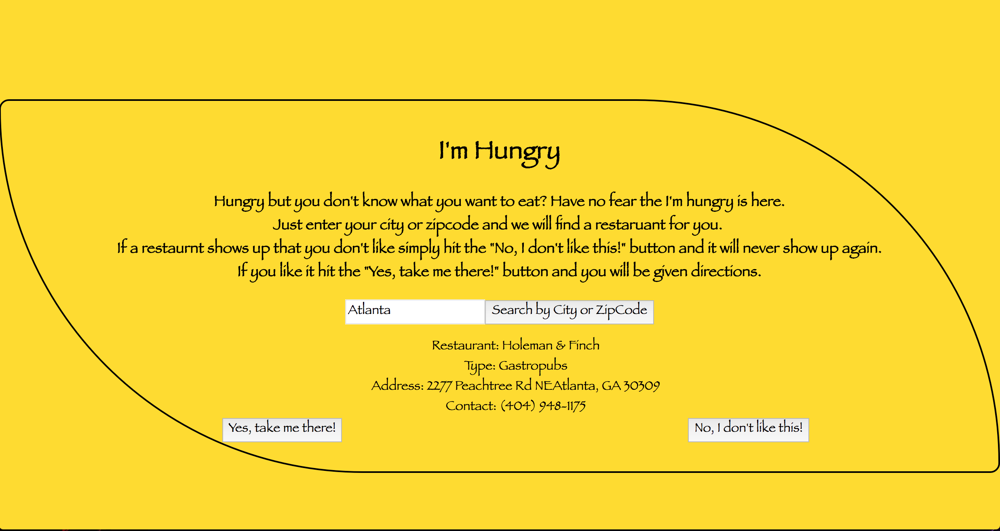

# I'm Hungry
Have you ever been hungry but don't know what to eat? If that's you then you've come to the right app. By entering you zip code or city our app will randomly generate a restaurant for you. If you like it then press the yes, take me there button and it will take you to google maps. If you hit the No, I don't like this button it will generate a new restaurant for you. The app is responsive so you can use it on your mobile devices. 

## Technology Used
**FrontEnd**: React, Redux, CSS, JSX, Javasript  
**BackEnd**: NodeJs, Express, MongoDB, Mongoose, Mlab, yelpAPI  
**Deployment**: Heroku, Travis   

## Documentation of API  
**GET** https://full-stack-hungry-app.herokuapp.com/api/restaurants  
Allows you to see all the information about the restaurant coming from yelpAPI  
**GET** https://full-stack-hungry-app.herokuapp.com/api/users  
Allows you to see the users in the database  
**POST** https://full-stack-hungry-app.herokuapp.com/api/users  
Allows you to create a user users in the database  
**POST** https://full-stack-hungry-app.herokuapp.com/api/users/:id/nevers  
Allows you to add a restaurant to a list of restaurants you don't want to see  

## How to use our code  
* Fork it to your repo.
* Clone Repo: `git clone repo_link`
* Install the dependencies: `npm install`
* Run the development task: `npm run dev`
    * Starts a server running at http://localhost:8080
    * Automatically rebuilds when any of your files change

## Screenshots  

#### Before Search  
 

#### After Search  
 

### Mobile Views  
